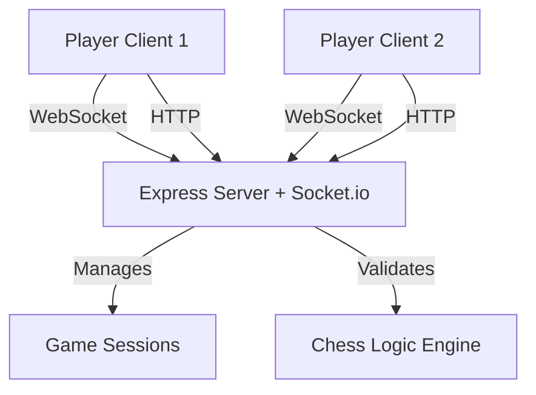

# Design Document

## Overview

ChessDict is a full-stack web application built with Node.js, Express.js, and Socket.io for the backend, and vanilla JavaScript with ES6+ features for the frontend. The architecture follows a client-server model with WebSocket-based real-time communication for instant move synchronization.

## Architecture

### High-Level Architecture



### Technology Stack

- **Backend**: Node.js with Express.js framework
- **Real-time Communication**: Socket.io for WebSocket management
- **Frontend**: Vanilla JavaScript (ES6+), HTML5, CSS3
- **Chess Logic**: Custom JavaScript implementation of chess rules

## Components and Interfaces

### Backend Components

#### 1. Express Server (`server.js`)
- Serves static files (HTML, CSS, JS)
- Handles HTTP routes for game creation and joining
- Initializes Socket.io server

#### 2. Socket.io Manager (`socketHandler.js`)
- Manages WebSocket connections
- Handles player join/disconnect events
- Broadcasts moves between players
- Maintains connection state

#### 3. Game Session Manager (`gameManager.js`)
- Creates and tracks active game sessions
- Assigns players to games
- Stores game state in memory
- Manages game lifecycle

**Interface:**
```javascript
class GameManager {
  createGame() // Returns gameId
  joinGame(gameId, playerId) // Returns player color
  getGame(gameId) // Returns game state
  updateGame(gameId, newState) // Updates game state
  endGame(gameId) // Cleans up game session
}
```

#### 4. Chess Logic Engine (`chessEngine.js`)
- Validates moves according to chess rules
- Calculates legal moves for pieces
- Detects check, checkmate, and stalemate
- Manages turn order

**Interface:**
```javascript
class ChessEngine {
  isValidMove(from, to, gameState) // Returns boolean
  getLegalMoves(position, gameState) // Returns array of positions
  makeMove(from, to, gameState) // Returns new game state
  isCheck(color, gameState) // Returns boolean
  isCheckmate(color, gameState) // Returns boolean
  isStalemate(gameState) // Returns boolean
}
```

### Frontend Components

#### 1. Game Client (`client.js`)
- Establishes Socket.io connection
- Handles user interactions
- Sends move requests to server
- Receives and applies opponent moves

#### 2. Board Renderer (`board.js`)
- Renders chess board and pieces
- Handles piece selection and highlighting
- Animates piece movements
- Updates UI based on game state

**Interface:**
```javascript
class BoardRenderer {
  render(gameState) // Renders current board
  highlightSquare(position) // Highlights a square
  movePiece(from, to, animate) // Moves piece with optional animation
  showLegalMoves(position) // Shows valid moves for selected piece
}
```

#### 3. UI Controller (`ui.js`)
- Manages game status display
- Shows connection status
- Handles game end screens
- Provides new game functionality

## Data Models

### Game State
```javascript
{
  gameId: String,
  board: Array[8][8], // 2D array of pieces
  currentTurn: 'white' | 'black',
  players: {
    white: { id: String, connected: Boolean },
    black: { id: String, connected: Boolean }
  },
  status: 'waiting' | 'active' | 'checkmate' | 'stalemate' | 'draw',
  winner: 'white' | 'black' | null,
  moveHistory: Array[{from, to, piece, timestamp}]
}
```

### Piece Representation
```javascript
{
  type: 'pawn' | 'rook' | 'knight' | 'bishop' | 'queen' | 'king',
  color: 'white' | 'black',
  position: { row: Number, col: Number },
  hasMoved: Boolean // For castling and pawn double-move
}
```

### Socket Events

**Client → Server:**
- `createGame` - Request new game creation
- `joinGame` - Join existing game with gameId
- `makeMove` - Submit a move {from, to}
- `disconnect` - Player disconnects

**Server → Client:**
- `gameCreated` - Game created with gameId
- `gameJoined` - Successfully joined, receive color and game state
- `moveMade` - Opponent made a move
- `invalidMove` - Move was rejected
- `gameOver` - Game ended with result
- `opponentDisconnected` - Opponent lost connection
- `opponentReconnected` - Opponent reconnected

## Error Handling

### Connection Errors
- Implement automatic reconnection with exponential backoff
- Store game state locally to restore on reconnection
- Display connection status indicator to users
- Queue moves during disconnection and sync on reconnect

### Invalid Move Handling
- Validate moves on both client and server
- Client-side validation provides immediate feedback
- Server-side validation ensures game integrity
- Display error messages for invalid moves

### Game State Synchronization
- Server is source of truth for game state
- Clients request full state sync on reconnection
- Implement version numbers to detect state drift
- Rollback client state if server rejects move

## Testing Strategy

### Unit Tests
- Chess engine move validation
- Legal move calculation
- Check/checkmate detection
- Game state updates

### Integration Tests
- Socket.io event handling
- Game session lifecycle
- Player join/disconnect flows
- Move synchronization between clients

### Manual Testing
- End-to-end gameplay scenarios
- Network latency simulation
- Disconnect/reconnect scenarios
- Multiple concurrent games
- Browser compatibility (Chrome, Firefox, Safari, Edge)

## Performance Considerations

- Keep game state minimal to reduce transmission size
- Use efficient data structures for board representation
- Implement move validation caching for repeated calculations
- Limit move history to prevent memory growth
- Clean up completed game sessions after timeout period
